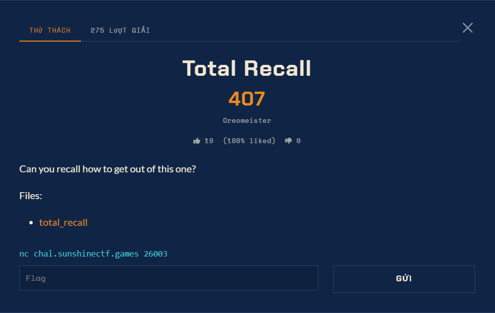

# Đề bài - total_recall



## Nguyên văn đề

```text
Total Recall
407 điểm · tác giả: Oreomeister · 275 lượt giải

Can you recall how to get out of this one?

Files: total_recall
nc chal.sunshinectf.games 26003
```

## Thông tin đã xác minh từ file

| Mục | Giá trị |
| --- | --- |
| Artifact | `files/total_recall` |
| Dịch vụ | `nc chal.sunshinectf.games 26003` |
| Điểm | 407 (dynamic) |
| Số lượt giải | 275 |
| Tác giả | Oreomeister |
| Định dạng cờ | không ghi trên thẻ đề; cờ của giải này dạng `sun{...}` |

## Hướng giải (tóm tắt)

<2-4 câu: primitive chính và cách ghép thành cờ.>

## Chạy lại lời giải

```bash
python exploit.py chal.sunshinectf.games 26003
```
