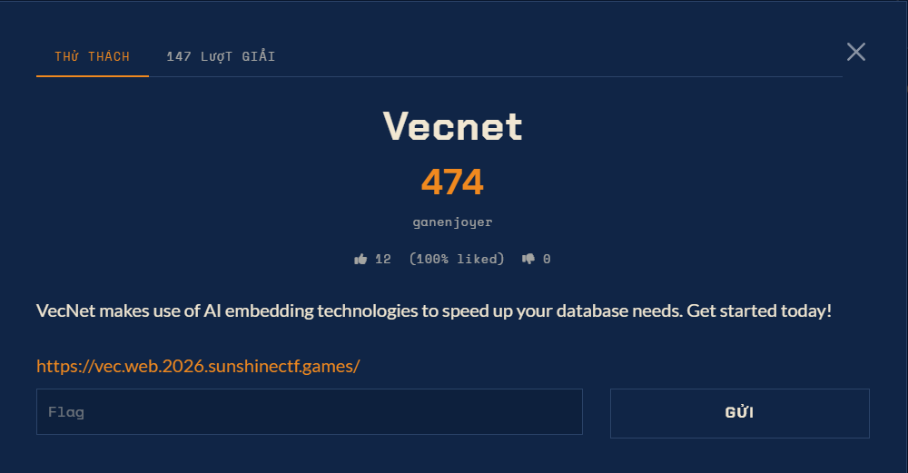

# VecNet — Web (Hard)

Ảnh đề bài gốc, chụp từ thẻ challenge:



## Description

> VecNet makes use of AI embedding technologies to speed up your database needs. Get started
> today!

| Field | Value |
| --- | --- |
| URL | `https://vec.web.2026.sunshinectf.games/` |
| File kèm theo | không có |
| Điểm | 493 |
| Số team giải lúc làm | 7 |

## Bề mặt tiếp cận

Trang chủ là một landing page tĩnh ("Semantic Mail Defense") nhưng lộ hai thứ:

* một link `Webmail Access` trỏ thẳng tới giao diện web của MailHog chạy trên **cổng 8025**,
* và `/.git` **công khai** trên 443.

Ngoài hai cổng đó container còn nghe **8000**: `GET /api/v2` trả `{"nanosecond heartbeat": ...}`,
tức là một Chroma server thật.

## Chuỗi kỹ thuật phải đi

1. Đọc `/.git` -> lấy `config.php` đã bị commit rồi "REVERT: do not commit secrets"; object vẫn còn.
2. `config.php` cho credentials của MailHog -> đọc mailbox qua REST API -> có tham số vec2text và
   URL nội bộ của `specs.7z`.
3. `fetch.php` (kèm trong repo) chỉ cho phép đúng một URL và trả về `specs.7z`: archive bị khoá
   7zAES, bên trong là `flag.txt` 34 byte.
4. Chroma trên 8000 có route bị lọc; phải dựng lại đường đi thật của Chroma 1.x mới đọc được
   collection. Trong collection có một record chỉ còn **embedding**, không còn document.
5. Đảo ngược embedding đó (vec2text) -> câu mô tả cấu trúc mật khẩu archive.
6. Băm brute-force cấu trúc đó vào record `user_hash_sha256` -> ra mật khẩu -> mở `specs.7z`.

## Cờ

```
sun{k33p_your_emb3ddings_secur3!}
```
