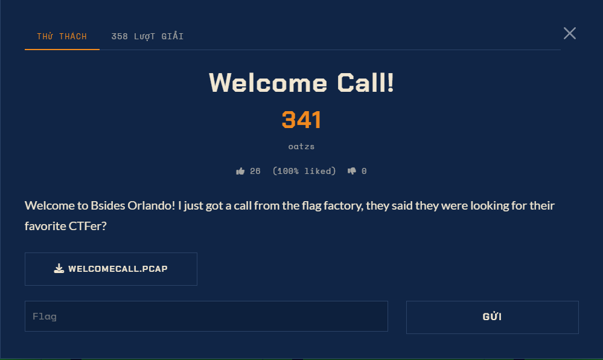

# Welcome Call — Forensics (Medium)

Ảnh đề bài gốc, chụp từ thẻ challenge:



## Đề (nguyên văn)

> Welcome to Bsides Orlando! I just got a call from the flag factory, they said they were looking for their favorite CTFer?

File: `WELCOMECALL.PCAP` (local: `C:\Users\Administrator\Downloads\welcomecall.pcap`,
181952 B, sha256 `7e0effd30dbd6fd0…`, pcap microseconds, Ethernet).

## Hợp đồng SIP rút ra từ capture

```
192.0.2.10:5060 -> 192.0.2.20:5060   INVITE sip:board@192.0.2.20:5060
    From: "Anonymous" <sip:anon@192.0.2.10>       Call-ID: anon-48271@192.0.2.10
    s=Anonymous voice chat
    m=audio 4000 RTP/AVP 0    a=rtpmap:0 PCMU/8000    a=ptime:20   a=sendonly
192.0.2.20:5060 -> 192.0.2.10:5060   SIP/2.0 200 OK
    m=audio 4002 RTP/AVP 0    a=rtpmap:0 PCMU/8000    a=ptime:20   a=recvonly
```

Một chiều thoại duy nhất: caller 192.0.2.10:4000 -> board 192.0.2.20:4002, **G.711 mu-law, 8 kHz**.

## Thống kê luồng RTP

| chỉ số | giá trị |
| --- | --- |
| packet RTP | 778 |
| payload | 124480 byte = 15.56 s |
| sequence gap | 0 |
| timestamp delta | luôn 160 mẫu (20 ms) |
| SSRC | duy nhất `48271739` |
| marker bit | chỉ packet đầu |
| telephone-event (PT 101) | không có |

## Nội dung cuộc gọi (audio ĐÃ bị đảo ngược thời gian)

```
Welcome to Bsides Orlando. The flag that you are looking for is Sun with a left curly
bracket. Thank you for playing right curly bracket. All lowercase, no spaces.
Thank you and have a good one.
```

Cờ: `sun{thankyouforplaying}`
