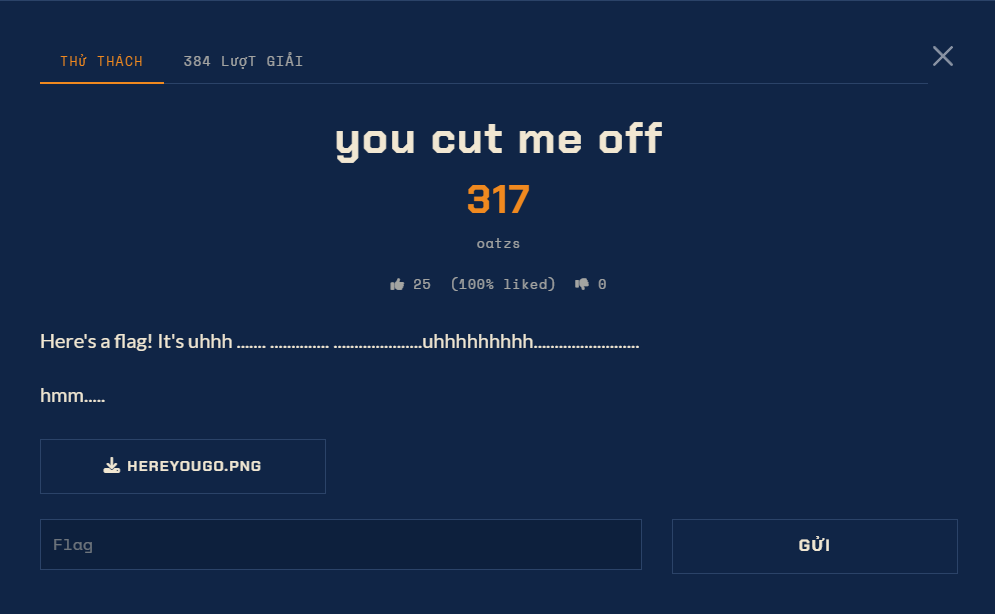

# You Cut Me Off - Forensics (Medium)

Ảnh đề bài gốc, chụp từ thẻ challenge:



## Challenge Text

```text
you cut me off - 491 điểm - oatzs - 87 solves

Here's a flag! It's uhhh ...... ............ ......................uhhhhhhhhhh.....................
hmm.....

File: HEREYOUGO.PNG
```

## Verified Metadata

| Field | Value |
| --- | --- |
| Artifact | `files/hereyougo.png` (copy từ: `~/Downloads/hereyougo.png`) |
| Size | 38759 B |
| SHA-256 | xem `flag.txt` bên cạnh, file không đổi: `hereyougo.png` 492x382 RGBA |
| File Type | PNG ảnh thật, không có metadata, không có chunk ẩn |
| Objective | tìm chuỗi cờ bị "cắt" khỏi ảnh |
| Flag Format | `sun{...}` |

## Approach Summary

`IHDR` khai báo chiều cao 382 dòng nhưng chuỗi IDAT giải nén ra đúng 418 dòng scanline
(823042 = 418 x 1969). Trình xem ảnh chỉ vẽ 382 dòng theo header, 36 dòng còn lại vẫn nằm
trong file. Sửa chiều cao dựng lại ảnh đầy đủ thì dòng tin nhắn bị cắt hiện ra, chứa cờ.

## Reproduce

```bash
python solve.py
```

Kết quả: `sun{totallyoriginalchallengeidea}` (đã lưu trong `flag.txt`).
